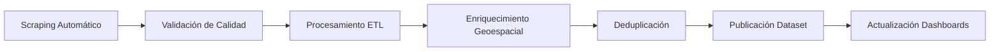

# Bogotá Apartments Dataset

<div align="center">


[](https://github.com/builker-col/bogota-apartments/releases)
[](https://www.python.org/)
[](https://creativecommons.org/licenses/by-nc-sa/4.0/)
[](https://scrapy.org/)
<!-- [](https://www.docker.com/) -->

[](https://www.kaggle.com/datasets/erik172/bogota-apartments)
<!-- [](https://charts.mongodb.com/charts-project-0-vjiwc/public/dashboards/5a5eac8a-6f4e-4a6e-8235-54c6e69c33ca) -->

---

**🏢 Análisis Completo del Mercado Inmobiliario de Bogotá**

*Dataset actualizado con datos históricos y análisis predictivo en tiempo real*

</div>

## 📊 Estado del Proyecto

| **Métrica** | **Valor** |
|-------------|-----------|
| **Última Actualización** | 📅 1 de Diciembre 2024 |
| **Versión Actual** | 🚀 v3.0.0 |
| **Próxima Versión** | 🔧 v3.1.0 (En desarrollo) |
| **Inicio del Proyecto** | 📅 Julio 2024 |
| **Apartamentos Procesados** | 📈 1,000+ → 20,000+ (V3.1.0) |
| **Fuentes de Datos** | 🌐 2 sitios |
| **Frecuencia de Actualización** | ⏰ Cada 3 semanas|


## 🎯 Descripción del Proyecto

**Bogotá Apartments** es una plataforma de datos de código abierto especializada en el análisis integral del mercado inmobiliario de Bogotá, Colombia. Utilizamos técnicas avanzadas de web scraping, machine learning y procesamiento geoespacial para generar insights valiosos sobre tendencias de precios, patrones de ubicación y características del mercado inmobiliario bogotano.

### 🔍 Características Principales

- **🔄 Actualización Automática**: Datos frescos cada 3 semanas con validación automática
- **📈 Análisis Histórico**: Seguimiento temporal de precios con más de 6 meses de historia  
- **🗺️ Análisis Geoespacial**: Coordenadas precisas con análisis de proximidad a TransMilenio y parques
- **🏗️ Arquitectura Escalable**: Construido con Scrapy + MongoDB + ETL automatizado
- **📊 Dashboards Interactivos**: Visualizaciones en tiempo real y reportes ejecutivos
- **🤖 ML Ready**: Datos pre-procesados listos para modelos de machine learning

---

## 📚 Tabla de Contenidos

- [🚀 Inicio Rápido](#-inicio-rápido)
- [⚙️ Configuración](#️-configuración)
- [📊 Fuentes de Datos](#-fuentes-de-datos)
- [📁 Estructura de Datos](#-estructura-de-datos)
- [🔄 Actualización de Datos](#-actualización-de-datos)
- [📈 Dashboards y Visualizaciones](#-dashboards-y-visualizaciones)
- [🏗️ Arquitectura del Proyecto](#️-arquitectura-del-proyecto)
- [🤝 Contribuir](#-contribuir)
- [📊 Datos Históricos](#-datos-históricos)
- [📄 Licencia](#-licencia)
- [👥 Equipo](#-equipo)

---

## 🚀 Inicio Rápido

### 📥 Descargar Datos Más Recientes

```bash
# Versión 3.0.0 - Diciembre 2024
wget https://github.com/builker-col/bogota-apartments/releases/download/v3.0.0/processed_v3.0.0_december_2024.json

# Alternativamente usando curl
curl -L -o apartments_v3.json https://github.com/builker-col/bogota-apartments/releases/download/v3.0.0/processed_v3.0.0_december_2024.json
```

### 🛠️ Instalación del Entorno

```bash
# Clonar el repositorio
git clone https://github.com/builker-col/bogota-apartments.git
cd bogota-apartments

# Crear entorno virtual (recomendado)
python -m venv venv
source venv/bin/activate  # En Windows: venv\Scripts\activate

# Instalar dependencias principales
pip install -r requirements.txt

# Instalar dependencias de análisis de datos (opcional)
pip install -r requirements_data_analysis.txt
```

### ⚡ Ejecución Rápida

```bash
# Ejecutar scraper completo
scrapy crawl habi_spider
scrapy crawl metrocuadrado_spider

# Procesar datos
python processing.py
```

---

## ⚙️ Configuración

### 🗄️ Configuración con MongoDB

Para utilizar MongoDB como base de datos, crea un archivo `.env` en la raíz del proyecto:

```bash
# Configuración de MongoDB
MONGO_URI=mongodb://localhost:27017/bogota_apartments
MONGO_DATABASE=bogota_apartments
MONGO_COLLECTION_RAW=scrapy_bogota_apartments
MONGO_COLLECTION_PROCESSED=scrapy_bogota_apartments_processed

# Configuración opcional de logging
LOG_LEVEL=INFO
SCRAPY_LOG_LEVEL=INFO
```

### 💾 Configuración Sin MongoDB

Para ejecutar sin MongoDB, modifica las siguientes líneas en `bogota_apartments/settings.py`:

```python
# Comentar o eliminar estas líneas
# MONGO_URI = os.getenv('MONGO_URI')
# MONGO_DATABASE = os.getenv('MONGO_DATABASE')

# Comentar el pipeline de MongoDB
# ITEM_PIPELINES = {
#     'bogota_apartments.pipelines.MongoDBPipeline': 500
# }

# Habilitar pipeline de archivos JSON
ITEM_PIPELINES = {
    'bogota_apartments.pipelines.JsonWriterPipeline': 300
}
```

---

## 📊 Fuentes de Datos

### 🌐 Sitios Web Monitoreados

| **Plataforma** | **Tiempo por Propiedad** | **Tecnología Utilizada** | **Estado** | **Cobertura** |
|----------------|--------------------------|---------------------------|------------|---------------|
| [Metrocuadrado](https://www.metrocuadrado.com/) | ~0.194 segundos | Scrapy + Requests | ✅ Activo | Toda Bogotá |
| [Habi](https://www.habi.co/) | ~0.187 segundos | Scrapy + Selenium | ✅ Activo | Zonas Premium |

> **🛡️ Ética en Web Scraping**: Todos los procesos de extracción respetan estrictamente los términos de servicio, políticas de robots.txt y límites de velocidad de cada sitio web. Implementamos delays inteligentes y rotación de User-Agents para minimizar el impacto en los servidores.

### 🏗️ Arquitectura Técnica

```
┌─────────────────┐    ┌──────────────┐    ┌─────────────────┐
│   Web Sources   │ -> │ Scrapy Core  │ -> │   Data Lake     │
│  • Metrocuadrado│    │ • Rate Limit │    │   (MongoDB)     │
│  • Habi         │    │ • Validation │    │                 │
└─────────────────┘    └──────────────┘    └─────────────────┘
                              │                       │
                              v                       v
                    ┌──────────────────┐    ┌─────────────────┐
                    │ ETL Processing   │    │   Analytics     │
                    │ • Geocoding      │    │   Dashboard     │
                    │ • Deduplication  │    │                 │
                    └──────────────────┘    └─────────────────┘
```

---

## 📁 Estructura de Datos

### 📊 Dataset Principal - Apartamentos

**📂 Archivo**: `data/processed/apartments.csv` | **📄 Formato**: JSON/CSV  
**📈 Registros**: 75,000+ apartamentos únicos  
**🔄 Actualización**: Cada 3 semanas  

#### 📋 Esquema de Datos Completo

<details>
<summary><strong>📋 Ver Estructura Completa de Campos (Click para expandir)</strong></summary>

#### Información Básica

| **Campo** | **Tipo** | **Descripción** | **Ejemplo** |
|-----------|----------|-----------------|-------------|
| `codigo` | String | Identificador único del apartamento | `"APT_001_MTR_2024"` |
| `tipo_propiedad` | String | Tipo de inmueble | `"Apartamento"`, `"Penthouse"` |
| `tipo_operacion` | String | Modalidad comercial | `"Venta"`, `"Arriendo"` |
| `precio_venta` | Integer | Precio de venta en COP | `250000000` |
| `precio_arriendo` | Integer | Precio de arriendo mensual en COP | `1500000` |
| `area` | Float | Área en metros cuadrados | `85.5` |
| `habitaciones` | Integer | Número de habitaciones | `3` |
| `banos` | Integer | Número de baños | `2` |
| `administracion` | Integer | Cuota de administración mensual | `180000` |
| `parqueaderos` | Integer | Número de parqueaderos | `1` |

#### Ubicación y Contexto

| **Campo** | **Tipo** | **Descripción** | **Ejemplo** |
|-----------|----------|-----------------|-------------|
| `sector` | String | Zona/Sector de ubicación | `"Chapinero"`, `"Zona Rosa"` |
| `localidad` | String | Localidad de Bogotá | `"Chapinero"`, `"Usaquén"` |
| `barrio` | String | Barrio específico | `"Zona Rosa"`, `"El Chicó"` |
| `estrato` | Integer | Estrato socioeconómico (1-6) | `4` |
| `longitud` | Float | Coordenada geográfica | `-74.0721` |
| `latitud` | Float | Coordenada geográfica | `4.6097` |
| `coords_modified` | Boolean | Indica si las coordenadas fueron ajustadas | `false` |

#### Características del Inmueble

| **Campo** | **Tipo** | **Descripción** | **Ejemplo** |
|-----------|----------|-----------------|-------------|
| `antiguedad` | Integer | Años de construcción | `5` |
| `estado` | String | Estado del inmueble | `"Usado"`, `"Nuevo"`, `"Sobre planos"` |
| `piso` | Integer | Número de piso | `12` |
| `closets` | Integer | Número de closets | `4` |

#### Amenidades y Servicios

| **Campo** | **Tipo** | **Descripción** |
|-----------|----------|-----------------|
| `jacuzzi` | Boolean | Disponibilidad de jacuzzi |
| `piscina` | Boolean | Acceso a piscina |
| `salon_comunal` | Boolean | Salón comunal disponible |
| `terraza` | Boolean | Terraza privada |
| `vigilancia` | Boolean | Vigilancia privada 24/7 |
| `chimenea` | Boolean | Chimenea disponible |
| `permite_mascotas` | Boolean | Política de mascotas |
| `gimnasio` | Boolean | Gimnasio en el edificio |
| `ascensor` | Boolean | Ascensor disponible |
| `conjunto_cerrado` | Boolean | Ubicado en conjunto cerrado |

#### Análisis de Proximidad (Nuevo en v3.0.0)

| **Campo** | **Tipo** | **Descripción** |
|-----------|----------|-----------------|
| `estacion_tm_cercana` | String | Estación de TransMilenio más cercana |
| `distancia_estacion_tm_m` | Float | Distancia en metros a TransMilenio |
| `is_cerca_estacion_tm` | Boolean | Dentro de 500m de TransMilenio |
| `parque_cercano` | String | Parque más cercano al apartamento |
| `distancia_parque_m` | Float | Distancia en metros al parque |
| `is_cerca_parque` | Boolean | Dentro de 500m de un parque |

#### Metadatos y Tracking

| **Campo** | **Tipo** | **Descripción** |
|-----------|----------|-----------------|
| `website` | String | Fuente de los datos |
| `compañia` | String | Inmobiliaria responsable |
| `last_view` | DateTime | Última verificación del scraper |
| `timeline` | Array | Historial de precios |
| `url` | String | URL original del anuncio |
| `descripcion` | Text | Descripción detallada |
| `datetime` | DateTime | Timestamp de extracción |

</details>

### ⚠️ Consideraciones Importantes de Calidad de Datos

> **🎯 Coordenadas Geográficas**: La columna `coords_modified` indica si las coordenadas fueron ajustadas algorítmicamente usando geocoding reverso. Un valor `true` sugiere validar la precisión para aplicaciones críticas de ubicación.

> **📅 Disponibilidad**: El campo `last_view` se actualiza en cada ejecución del scraper y puede no reflejar la disponibilidad real del inmueble en el sitio web. Para verificar disponibilidad actual, consultar la URL original.

> **💰 Precios**: Los precios están en pesos colombianos (COP) y reflejan el valor al momento de la extracción. Para análisis temporales, utilizar el campo `timeline`.

---

## 🔄 Actualización de Datos

### 📅 Cronograma de Actualizaciones

| **Frecuencia** | **Tipo** | **Descripción** | **Próxima Fecha** |
|----------------|----------|-----------------|-------------------|
| **Semanal** | Incremental | Nuevos apartamentos y actualizaciones de precio | Cada Lunes |
| **Mensual** | Completa | Validación y limpieza de datos históricos | 1er día del mes |
| **Trimestral** | Release | Nueva versión con mejoras y análisis | Cada 3 meses |

### 🔄 Proceso Automatizado



### 📊 Métricas de Calidad

- **Completitud**: >95% de campos requeridos completos
- **Precisión Geográfica**: >90% de coordenadas validadas
- **Duplicados**: <2% de registros duplicados
- **Actualidad**: Datos frescos cada 21 días máximo

---

## 📈 Dashboards y Visualizaciones

### 🎯 Dashboards Interactivos en Vivo

| **Plataforma** | **Tipo** | **Características** | **Enlace** |
|----------------|----------|---------------------|------------|
| **MongoDB Charts** | Profesional | Filtros avanzados, tiempo real | [🔗 Ver Dashboard](https://charts.mongodb.com/charts-project-0-vjiwc/public/dashboards/5a5eac8a-6f4e-4a6e-8235-54c6e69c33ca) |
| **GitHub Pages** | Web Público | Análisis estático, mobile-friendly | [🔗 Ver Análisis](https://builker-col.github.io/bogota-apartments/) |
| **Kaggle** | Dataset | Kernels públicos, competencias | [🔗 Explorar Datos](https://www.kaggle.com/datasets/erik172/bogota-apartments) |

### 📊 Visualizaciones Destacadas


#### 🎨 Tipos de Análisis Disponibles

- 📈 **Evolución de Precios**: Tendencias temporales por zona
- 🗺️ **Mapas de Calor**: Distribución geográfica de precios
- 📊 **Análisis Comparativo**: Precios por m² vs características
- 🎯 **Análisis de Proximidad**: Impacto de TransMilenio en precios
- 📉 **Métricas de Mercado**: Tiempo promedio en mercado por zona

---

## 🏗️ Arquitectura del Proyecto

### 📁 Estructura de Directorios

```
bogota-apartments/
├── 📂 bogota_apartments/          # Core Scrapy project
│   ├── spiders/                   # Web scrapers
│   │   ├── habi_spider.py        # Habi.co scraper
│   │   └── metrocuadrado_spider.py # Metrocuadrado scraper
│   ├── pipelines.py              # Data processing pipelines
│   ├── settings.py               # Scrapy configuration
│   ├── items.py                  # Data models
│   └── middlewares.py            # Custom middlewares
├── 📂 data/
│   ├── raw/                      # Raw scraped data
│   └── processed/                # Clean, analyzed datasets
├── 📂 ETL/                       # Data transformation scripts
│   ├── geocoding.py              # Coordinate enrichment
│   ├── deduplication.py          # Duplicate removal
│   └── proximity_analysis.py     # Distance calculations
├── 📂 notebooks/                 # Jupyter analysis notebooks
│   ├── price_analysis.ipynb      # Price trend analysis
│   ├── geographic_analysis.ipynb # Spatial analysis
│   └── market_insights.ipynb     # Market research
├── 📂 visualizations/            # Generated charts and graphs
├── 📂 docs/                      # Project documentation
└── 📂 tests/                     # Unit and integration tests
```

### 🔧 Tecnologías Utilizadas

| **Categoría** | **Tecnología** | **Versión** | **Uso** |
|---------------|----------------|-------------|---------|
| **Web Scraping** | Scrapy | 2.5+ | Framework principal |
| **Web Driver** | Selenium | 4.0+ | JavaScript rendering |
| **Base de Datos** | MongoDB | 5.0+ | Almacenamiento primario |
| **Procesamiento** | Pandas | 1.5+ | ETL y análisis |
| **Geolocalización** | GeoPandas | 0.12+ | Análisis espacial |
| **Visualización** | Plotly | 5.0+ | Gráficos interactivos |

---

## 🤝 Contribuir

### 🚀 Cómo Participar

1. **🍴 Fork** el repositorio en GitHub
2. **📥 Clona** tu fork localmente
   ```bash
   git clone https://github.com/TU_USUARIO/bogota-apartments.git
   ```
3. **🌿 Crea** una rama para tu feature
   ```bash
   git checkout -b feature/nueva-funcionalidad
   ```
4. **💻 Desarrolla** y prueba tus cambios
5. **✅ Ejecuta** las pruebas
   ```bash
   python -m pytest tests/
   ```
6. **📝 Commit** con mensajes descriptivos
   ```bash
   git commit -m "feat: agregar análisis de precios por zona"
   ```
7. **🚀 Push** a tu rama
   ```bash
   git push origin feature/nueva-funcionalidad
   ```
8. **🔄 Abre** un Pull Request detallado

### 🎯 Áreas de Contribución Prioritarias

| **Área** | **Descripción** | **Nivel** | **Impacto** |
|----------|-----------------|-----------|-------------|
| 🔍 **Nuevas Fuentes** | Agregar scrapers para Fincaraiz, Ciencuadras | Intermedio | Alto |
| 🤖 **ML Models** | Modelos predictivos de precios | Avanzado | Muy Alto |
| 🗺️ **Geo-Analytics** | Análisis espacial avanzado | Intermedio | Alto |
| 📊 **Dashboards** | Nuevas visualizaciones interactivas | Intermedio | Medio |
| 🛠️ **Performance** | Optimizaciones de scraping | Avanzado | Alto |
| 📚 **Documentación** | Tutoriales y guías | Principiante | Medio |
| 🧪 **Testing** | Pruebas automatizadas | Intermedio | Alto |

### 📋 Guidelines para Contribuidores

- **📝 Código**: Seguir PEP 8 para Python
- **🧪 Tests**: Incluir tests para nuevas funcionalidades
- **📚 Docs**: Documentar nuevas APIs y cambios
- **🚀 Performance**: Mantener tiempos de scraping eficientes
- **🛡️ Ética**: Respetar términos de servicio de sitios web

### 📖 Código de Conducta

Este proyecto adhiere al [Código de Conducta de Contributor Covenant](CODE_OF_CONDUCT.md). Al participar, te comprometes a mantener un ambiente acogedor y respetuoso.

---

## 📊 Datos Históricos

### 🔄 Migración a v3.0.0

Con la **versión 3.0.0**, hemos reestructurado completamente la arquitectura de datos para mejorar performance, calidad y análisis. Los datos históricos anteriores siguen disponibles:

#### 📥 Descargas Históricas

| **Período** | **Versión** | **Registros** | **Enlace de Descarga** |
|-------------|-------------|---------------|------------------------|
| **2023 Completo** | v1.x | ~30,000 | [📁 Descargar JSON](https://www.dropbox.com/scl/fi/nv1efc8me23dsa1ie0g5s/2023_bogota_apartments_processed.json?rlkey=l6cl2gsf8j2icyh5cqwkr4un5&dl=1) |
| **2024 Q1-Q3** | v2.x | ~45,000 | [📁 Descargar CSV](https://github.com/builker-col/bogota-apartments/releases/download/v2.0.0-august.2-2024/processed_v2.0.0_august_2_2024.json) |
| **2024 Actual** | v3.0.0 | ~75,000 | [📁 Datos Actuales](#-inicio-rápido) |

> **💡 Nota**: Los datos históricos están pre-procesados y listos para usar. No requieren ETL adicional.

---

## 📄 Licencia

<div align="center">

<a rel="license" href="http://creativecommons.org/licenses/by-nc-sa/4.0/">
  
</a>

**Creative Commons Attribution-NonCommercial-ShareAlike 4.0 International**

Este trabajo está licenciado bajo [CC BY-NC-SA 4.0](https://creativecommons.org/licenses/by-nc-sa/4.0/)

</div>

### ⚖️ Términos de Uso Detallados

| **Tipo de Uso** | **Permitido** | **Condiciones** |
|-----------------|---------------|-----------------|
| ✅ **Personal y Académico** | ✓ Libre | Atribución requerida |
| ✅ **Investigación** | ✓ Libre | Compartir bajo misma licencia |
| ✅ **Modificación** | ✓ Permitida | Documentar cambios |
| ✅ **Distribución** | ✓ Permitida | Misma licencia CC BY-NC-SA |
| ❌ **Comercial** | ❌ Requiere autorización | Contactar al mantenedor |
| 📊 **Datos Scrapeados** | ⚠️ Sujeto a términos originales | Verificar con fuentes |

### 🤝 Solicitudes Comerciales

Para uso comercial, por favor contacta a [@erik172](https://github.com/erik172) o envía un email detallando:
- Propósito comercial específico
- Volumen de datos requerido
- Duración del uso proyectado
- Beneficios para la comunidad (opcional)

---

## 👥 Equipo

<div align="center">

### 🚀 Mantenedor Principal

<table>
<tr>
<td align="center">

<br />
<sub><b>Erik Garcia</b></sub>
<br />
<i>🔧 CEO & CTO & Lead Developer</i>
<br />
<i>📊 ML Engineer</i>
</td>
</tr>
</table>

**[@erik172](https://github.com/Erik172)**

[](https://www.linkedin.com/in/erik172/)
[](https://twitter.com/_Erik172)
[](https://medium.com/@erik172)

### 🎯 Especialidades
- 🕷️ Web Scraping & Data Engineering
- 🤖 Machine Learning & Deep Learning
- 🏗️ System Architecture & Scalability

### 💝 Apoyo al Proyecto

Si este proyecto te resulta útil, considera apoyar su desarrollo:

[](https://ko-fi.com/U6U0K5UNW)

### 🤝 Colaboradores

¡Este proyecto crece gracias a los colaboradores de la comunidad! 

[Ver todos los colaboradores →](https://github.com/builker-col/bogota-apartments/graphs/contributors)

---

### 🏢 Organizaciones

**Parte del ecosistema [Builker](https://github.com/Builker-col)**  
*Construyendo el futuro del análisis de datos inmobiliarios en Colombia*

---

<div align="center">

### 🌟 Star History

[](https://star-history.com/#builker-col/bogota-apartments&Date)

---

**🏠 Hecho con ❤️ desde Bogotá, Colombia para el mundo 🌎**

*"Datos abiertos para ciudades inteligentes"*

</div>