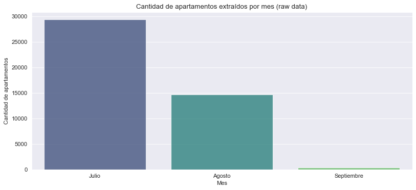

# Bogota Apartments

[](https://ko-fi.com/U6U0K5UNW)
[](https://medium.com/@erik172) 
[](https://github.com/builker-col/bogota-apartments)
[](https://www.linkedin.com/in/erik172/)
[](https://twitter.com/_Erik172)
[](https://www.kaggle.com/datasets/erik172/bogota-apartments)
[](https://www.python.org/)


La última fecha de scrapeo fue: **1 de Septiembre 2024**

Inicio de scrapeo: **Julio 2024**

Version: **V2.0.0 AUGUST.2 2024**

Descargar ultimos datos: [https://github.com/builker-col/bogota-apartments/releases/tag/v2.0.0-august.2-2024](https://github.com/builker-col/bogota-apartments/releases/tag/v2.0.0-august.2-2024)

## Índice
- [Bogota Apartments](#bogota-apartments)
  - [Índice](#índice)
  - [Descripción](#descripción)
  - [Configuración](#configuración)
    - [Quitar Configuración de mongoDB](#quitar-configuración-de-mongodb)
  - [Tiempos de Ejecución por Apartamento](#tiempos-de-ejecución-por-apartamento)
  - [Data Source](#data-source)
  - [Datos](#datos)
    - [Apartamentos](#apartamentos)
    - [Imagenes](#imagenes)
    - [Datos del 2023](#datos-del-2023)
  - [Actualización de los Datos](#actualización-de-los-datos)
  - [MongoDB Dashboard](#mongodb-dashboard)
  - [Cómo contribuir](#cómo-contribuir)
  - [Mantenimiento](#mantenimiento)
  - [Licencia](#licencia)
  - [Créditos](#créditos)

**Datos:**
- [Datos Procesados](data/processed/)
    - [Readme de Datos Procesados](data/processed/README.md)
    - [Apartamentos](data/processed/apartments.csv)
    - [Imágenes](data/processed/images.csv)
- [Datos RAW](data/raw/)
    - [Readme de Datos RAW](data/raw/README.md)
    - [Apartamentos](https://www.dropbox.com/s/1ly47276dnqqdzp/builker.scrapy_bogota_apartments.json?dl=1)

From **Bogota** co to the world 🌎

## Descripción

El Proyecto Bogotá Apartments es una iniciativa de código abierto que busca recopilar y analizar datos sobre el mercado inmobiliario de apartamentos en la ciudad de Bogotá, Colombia. Utilizando avanzadas técnicas de web scraping y análisis de datos, este proyecto recopila información detallada sobre las ventas y alquileres de apartamentos en la ciudad, incluyendo un histórico de precios que brinda una visión temporal de la evolución del mercado.

El conjunto de datos generado está disponible para cualquier persona interesada en conocer más sobre el mercado inmobiliario de Bogotá y sus tendencias. Además, el proyecto presenta un análisis exploratorio de datos minucioso que proporciona información valiosa acerca de los precios, ubicaciones y características de los apartamentos en la ciudad.

El propósito fundamental del proyecto es estimular la investigación y el aprendizaje en el ámbito del análisis de datos y la ciencia de datos. El conjunto de datos puede ser utilizado para entrenar modelos de aprendizaje automático y realizar análisis más profundos sobre el mercado inmobiliario de la ciudad.

_Este proyecto hace parte [Builker](https://github.com/Builker-col)._

## Configuración

Si quieres ejecutar el proyecto con los servicios de mongoDB debes crear un archivo `.env` en la raiz del proyecto con las siguientes variables de entorno:

```bash
MONGO_URI=<<URI de conexión a MongoDB>>
MONGO_DATABASE=<<Nombre de la base de datos en MongoDB>>
MONGO_COLLECTION_RAW = 'scrapy_bogota_apartments' # Nombre de la colección donde se guardaran los datos RAW
MONGO_COLLECTION_PROCESSED = 'scrapy_bogota_apartments_processed' # Nombre de la colección donde se guardaran los datos procesados
```

### Quitar Configuración de mongoDB

Si prefieres no utilizar MongoDB, puedes comentar las siguientes líneas de código en el archivo `settings.py`:

```python
# MONGO_URI = os.getenv('MONGO_URI')
# MONGO_DATABASE = os.getenv('MONGO_DATABASE')
```

```python
#ITEM_PIPELINES = {
#    'bogota_apartments.pipelines.MongoDBPipeline': 500
#}
```

## Tiempos de Ejecución por Apartamento

A continuación se detalla el tiempo aproximado de extracción por apartamento para cada sitio web:

> ⚠️ Es importante destacar que estos tiempos son aproximados y pueden variar dependiendo de la velocidad de la conexión a Internet y de la carga del servidor del sitio web.

| Sitio Web | Tiempo por Apartamento |
|-----------|------------------------------------|
| Habi | 0.187 segundos |
| Metrocuadrado | 0.194 segundos |

Estos tiempos representan el promedio aproximado de tiempo que tomó extraer cada apartamento de los respectivos sitios web durante la ejecución del scraper. El tiempo de extracción de cada apartamento puede variar dependiendo de la velocidad de la conexión a Internet y de la carga del servidor del sitio web.
## Data Source

> ⚠️ Es importante destacar que durante el proceso de web scraping se respetaron las políticas y condiciones de uso establecidas por cada sitio web.

Los datos del proyecto fueron extraídos mediante web scraping de los siguientes sitios web:

- [Metrocuadrado](https://www.metrocuadrado.com/)
- [Habi](https://www.habi.co/)

Se implemento un scraper creado con la librería [Scrapy](https://scrapy.org/) y en caso de que el sitio web este creado con JavaScript [Scrapy](https://scrapy.org/) se conbinara con Selenium para poder extraer los datos.

## Datos



<!-- ### Raw Data -->

<!-- Para poder haceder a los datos RAW puede ejecutar el script `download_raw_data.py` en la ruta `data/raw/` o puede descargar los datos desde el siguiente enlace [https://www.dropbox.com/scl/fi/63rkv8ehjcqogptpn06gp/builker.scrapy_bogota_apartmentsV1.3.0_october_1_2023.json?rlkey=wvwpyu3buy0ii84wxayywz8ot&dl=1](https://www.dropbox.com/scl/fi/63rkv8ehjcqogptpn06gp/builker.scrapy_bogota_apartmentsV1.3.0_october_1_2023.json?rlkey=wvwpyu3buy0ii84wxayywz8ot&dl=1) -->

### Apartamentos

file: [processed_v2.0.0_august_2_2024.json](https://github.com/builker-col/bogota-apartments/releases/download/v2.0.0-august.2-2024/processed_v2.0.0_august_2_2024.json)

> ⚠️ **Advertencia**: La columna `coords_modified` indica si las coordenadas geográficas fueron modificadas durante el procesamiento de los datos. Si el valor es `True`, esto significa que las coordenadas originales fueron ajustadas o corregidas. Se recomienda precaución al utilizar estos datos, ya que pueden no reflejar las coordenadas geográficas exactas del apartamento. Es importante verificar la precisión y la fuente de las coordenadas antes de utilizarlas en aplicaciones o análisis que requieran una ubicación geográfica precisa.

> ⚠️ **Advertencia**: la columna `last_view` se actualiza cada vez que se ejecuta el scraper. por lo tanto, este dato no es exacto. ya que el scraper puede no visitar el apartamento y este seguir publicado en la pagina web. Se recomienda usar este dato como referencia y no como dato exacto. Para saber si el apartamento sigue publicado en la pagina web se recomienda verificar manualmente en la pagina web.


| Columna                              | Descripción                                               |
|--------------------------------------|-----------------------------------------------------------|
| codigo                               | Código único que identifica cada apartamento              |
| tipo_propiedad                       | Tipo de propiedad (apartamento, casa, etc.)               |
| tipo_operacion                       | Tipo de operación (venta, arriendo, etc.)                 |
| precio_venta                         | Precio de venta del apartamento COP                       |
| precio_arriendo                      | Precio de arriendo del apartamento COP                    |
| area                                 | Área del apartamento en metros cuadrados                  |
| habitaciones                         | Número de habitaciones del apartamento                    |
| banos                                | Número de baños del apartamento                           |
| administracion                       | Valor de la cuota de administración del apartamento       |
| parqueaderos                         | Número de parqueaderos disponibles                        |
| sector                               | Sector o zona en la que se encuentra el apartamento       |
| estrato                              | Estrato socioeconómico del apartamento                    |
| antiguedad                           | Antigüedad del apartamento en años                        |
| estado                               | Estado del apartamento (nuevo, usado)                     |
| longitud                             | Longitud geográfica del apartamento                       |
| latitud                              | Latitud geográfica del apartamento                        |
| descripcion                          | Descripción detallada del apartamento                     |
| datetime                             | Fecha y hora de extracción de los datos                   |
| jacuzzi                              | Indica si el apartamento cuenta con jacuzzi               |
| piscina                              | Indica si el apartamento cuenta con piscina               |
| salon_comunal                        | Indica si el apartamento cuenta con salón comunal         |
| terraza                              | Indica si el apartamento cuenta con terraza               |
| vigilancia                           | Indica si el apartamento cuenta con vigilancia privada    |
| piso                                 | Número de piso en el que se encuentra el apartamento      |
| closets                              | Número de closets en el apartamento                       |
| chimenea                             | Indica si el apartamento cuenta con chimenea              |
| permite_mascotas                     | Indica si se permiten mascotas en el apartamento          |
| gimnasio                             | Indica si el apartamento cuenta con gimnasio              |
| ascensor                             | Indica si el edificio cuenta con ascensor                 |
| conjunto_cerrado                     | Indica si el apartamento se encuentra en conjunto cerrado |
| coords_modified                      | Coordenadas modificadas del apartamento                   |
| localidad                            | Localidad en la que se encuentra el apartamento           |
| barrio                               | Barrio en el que se encuentra el apartamento              |
| estacion_tm_cercana                  | Nombre de la estacion de transporte masivo mas cercana    |
| distancia_estacion_tm_m              | Distancia a la estación de transporte masivo más cercana  |
| is_cerca_estacion_tm                 | Indica si está cerca de una estación de transporte masivo <= 500m |
| parque_cercano                       | Nombre del parque más cercano al apartamento              |
| distancia_parque_m                   | Distancia al parque más cercano al apartamento en metros  |
| is_cerca_parque                      | Indica si está cerca de un parque <= 500m                  |
| website                              | Sitio web relacionado a la propiedad                      |
| compañia                             | Compañía o agencia responsable de la propiedad            |
| last_view                            | Fecha de la ultima vez que el scraper visito el apartamento |
| timeline                             | Historial de precios del apartamento                      |
| url                                  | URL del apartamento                                       |

<!-- ### Imagenes

file: [images.csv](data/processed/images.csv)

| Columna      | Descripción                                      |
|--------------|--------------------------------------------------|
| codigo       | Código único que identifica cada apartamento.    |
| url_imagen   | Enlace URL de la imagen asociada al apartamento. | -->

### Datos del 2023
Con la **versión 2.0.0**, se realizó una actualización crucial en la estructura de datos, lo que conllevó a la eliminación de los datos anteriores a 2024 de nuestra base de datos. Si necesitas acceder a esta información del 2023, puedes descargarla desde la siguiente URL: [https://www.dropbox.com/scl/fi/nv1efc8me23dsa1ie0g5s/2023_bogota_apartments_processed.json?rlkey=l6cl2gsf8j2icyh5cqwkr4un5&dl=1](https://www.dropbox.com/scl/fi/nv1efc8me23dsa1ie0g5s/2023_bogota_apartments_processed.json?rlkey=l6cl2gsf8j2icyh5cqwkr4un5&dl=1)

Esta actualización asegura una estructura más optimizada y acorde con las necesidades actuales de los datos, por lo que te invitamos a obtener los datos actualizados del 2024 y posteriores para aprovechar al máximo nuestras últimas mejoras.

**Nota:** Los datos del 2023 ya estan procesados y no requieren de ningún procesamiento adicional.

## Actualización de los Datos

Los datos extraídos mediante web scraping serán actualizados regularmente para mantenerlos al día. A continuación se detallan los aspectos clave de la actualización:

- Los datos serán actualizados al menos cada 3 semanas, con una frecuencia mínima de actualización mensual. Esto asegurará que los datos reflejen la información más reciente disponible en las fuentes de origen.
- Durante el proceso de actualización, se revisarán y recopilarán los nuevos datos disponibles, así como se verificará la consistencia y calidad de los datos existentes.
- Se implementará un proceso automatizado para la actualización de los datos, utilizando herramientas y scripts específicos para realizar el web scraping de las fuentes de origen de manera eficiente y precisa.
- Después de cada actualización, se realizará un análisis y verificación de los datos para garantizar su integridad y confiabilidad.
- Se publicará la fecha de la última actualización en este README para que los usuarios puedan verificar la frescura de los datos.

## MongoDB Dashboard

Explora el tablero web para obtener una perspectiva interactiva de los apartamentos en Bogotá.

[MonogoDB Dashboard](https://charts.mongodb.com/charts-project-0-vjiwc/public/dashboards/5a5eac8a-6f4e-4a6e-8235-54c6e69c33ca)

[Dashboard from the web](https://builker-col.github.io/bogota-apartments/)

## Cómo contribuir
El proyecto es de código abierto y se anima a cualquier persona interesada en contribuir a hacerlo. Para contribuir al proyecto, por favor sigue estos pasos:

1. Haz un fork de este repositorio y clona el repositorio en tu máquina local.

1. Crea una nueva rama (`git checkout -b nombre-rama`) y realiza tus cambios en esa rama.

1. Haz commit a tus cambios (`git commit -m "Descripción de los cambios"`) y haz push a la rama (`git push origin nombre-rama`).

1. Abre un pull request en este repositorio y describe los cambios que has realizado.

1. Por favor, asegúrate de seguir las pautas de contribución antes de hacer un pull request.

## Mantenimiento
El conjunto de datos se actualizará regularmente para asegurarse de que se mantenga relevante y útil para la comunidad. Si encuentras algún error o tienes alguna sugerencia para mejorar el proyecto, por favor abre un issue en este repositorio.

## Licencia
El software aquí proporcionado se distribuye bajo los términos de la Licencia de Software de [Creative Commons Attribution-NonCommercial-ShareAlike 4.0 International](https://creativecommons.org/licenses/by-nc-sa/4.0/) (CC BY-NC-SA 4.0). Esto significa que los usuarios tienen el derecho de utilizar, modificar y distribuir el código fuente del scraper con la condición de que no se utilice con fines comerciales sin el permiso explícito del autor y que las obras derivadas se distribuyan bajo la misma licencia CC BY-NC-SA 4.0. Sin embargo, es importante tener en cuenta que esta licencia se aplica únicamente al software en sí, no a los datos que el scraper recopila o procesa. Los datos obtenidos por medio del scraper pueden estar sujetos a sus propias licencias o restricciones, dependiendo de su origen y de los términos establecidos por los propietarios de dichos datos

Para más información sobre la licencia, por favor lee el archivo [LICENSE](LICENSE).

<a rel="license" href="http://creativecommons.org/licenses/by-nc-sa/4.0/"></a><br />This work is licensed under a <a rel="license" href="http://creativecommons.org/licenses/by-nc-sa/4.0/">Creative Commons Attribution-NonCommercial-ShareAlike 4.0 International License</a>.

## Créditos
- [**@erik172**](https://github.com/Erik172) - Creador del proyecto y mantenedor principal.


Hecho con ❤️ por **@erik172**. 
